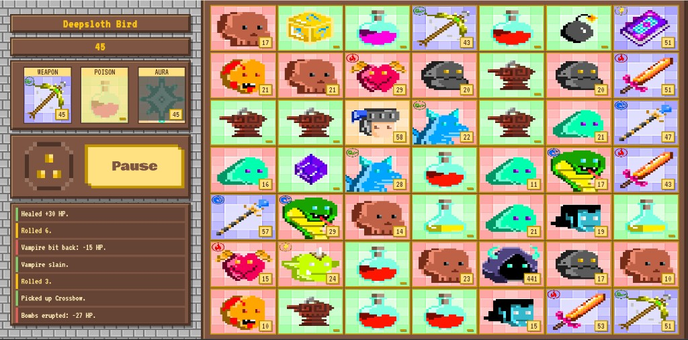

# Dungeon Mania
Dungeon Mania is a dice-based card game in which player navigate their character card across a board, with movement determined by the dice roll. Player interacts with other cards on the board as they progress.
## How To Play
Upon rolling the dice, player may move in any of the four cardinal directions (east, west, north, south) by the dice number and interact with the card they land on. Depending upon the card type, player's health might increase or decrease. Once health reaches zero, the game terminates.



## Languages Used
- **Frontend**: jQuery
- **Backend**: Express.js
- **Styling**: CSS
- **Templating**/**Rendering**: HTML, EJS

## Installation Guide

### Installation using Node.js
- Ensure you have Node.js installed on your system.
- Clone the repository:
  ```
  git clone https://github.com/codrshi/Dungeon-Mania.git
  ```
- Navigate to the `Dungeon-Mania` directory:
  ```
  cd Dungeon-Mania
  ```
- Run the deploy command:
  ```
  npm run deploy
  ```
- The game should now be running at http://localhost:3030

### Installation using docker
- Ensure you have docker installed on your system.

- Pull the latest docker image:
  ```
  docker pull codrshi/dungeon-mania:latest
  ```

- Run the docker image:
  ```
  docker run -p 3030:3030 codrshi/dungeon-mania:latest
  ```

- The game should now be running at http://localhost:3030

## Configuring the log level

The server emits four log levels — `ERROR`, `WARN`, `INFO`, `DEBUG` — and prints
everything from the chosen level upwards in severity. The default is `INFO`,
so `ERROR`, `WARN` and `INFO` are shown but `DEBUG` chatter is suppressed.

Supported flags (case-insensitive):

| Flag form | Example |
|---|---|
| `--log-level=<LEVEL>` | `--log-level=DEBUG` |
| `--log-level <LEVEL>` | `--log-level WARN` |
| `-l <LEVEL>` | `-l error` |

Invalid values are ignored with a warning and the default is kept.

### When running with `npm`
Use `--` to pass the flag through npm to the underlying `node` process:
```
npm run deploy -- --log-level=DEBUG
npm start    -- -l warn
```

### When running with Docker
Any arguments after the image name are appended to the container's entry
point (`node src/server.js`):
```
docker run -p 3030:3030 codrshi/dungeon-mania:latest --log-level=DEBUG
docker run -p 3030:3030 codrshi/dungeon-mania:latest -l warn
```

The first INFO line on startup will confirm the resolved level, e.g.:
```
[2026-06-14T...] [INFO] : game started on http://localhost:3030/ (log level = DEBUG)
```
