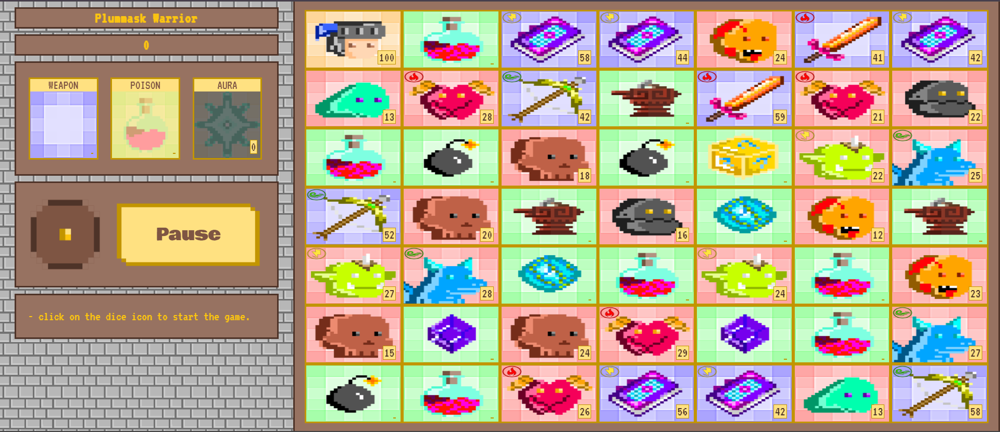

# Dungeon Mania
Dungeon Mania is a dice-based card game in which player navigate their character card across a board, with movement determined by the dice roll. Player interacts with other cards on the board as they progress.
## How To Play
Upon rolling the dice, player may move in any of the four cardinal directions (east, west, north, south) by the dice number and interact with the card they land on. Depending upon the card type, player's health might increase or decrease. Once health reaches zero, the game terminates.



## Languages Used
- **Frontend**: jQuery
- **Backend**: Express.js
- **Styling**: CSS
- **Templating**/**Rendering**: HTML, EJS

## Installation Guide
- Ensure you have Node.js installed on your system.
- Clone the repository:
  ```
  git clone https://github.com/codrshi/Dungeon-Mania.git
  ```
- Navigate to the `Dungeon-Mania` directory:
  ```
  cd Dungeon-Mania
  ```
- Install all Node dependencies:
  ```
  npm install
  ```
- Start the server:
  ```
  npm start
  ```
- The game should now be running at http://localhost:3030
